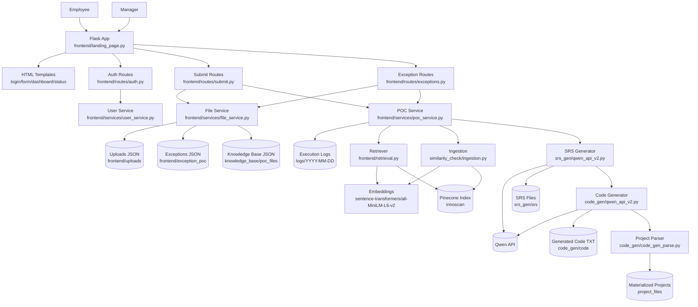

# InnoScan Workspace - Detailed Project Explainer

## 1) What This Workspace Is

This workspace is an AI-assisted innovation intake platform centered on a Flask app named **InnoScan**.

At a practical level, it does three jobs:

1. Collects new POC ideas from employees.
2. Checks if an idea is similar to existing POCs using vector similarity (Pinecone + embeddings).
3. Runs a manager exception workflow when similarity is high, and for approved/new ideas it can auto-generate:
   - an SRS document (via Qwen API), and
   - boilerplate code + full project file structure (via Qwen API + parser).

So this is not just a web form; it is a pipeline from idea intake -> similarity governance -> artifact generation.

---

## 2) Core Runtime App

Primary backend and UI server:
- `frontend/landing_page.py`

This file builds the Flask app, initializes default users, registers route modules, and starts the server on:
- Host: `127.0.0.1`
- Port: `5001`

Configuration and shared paths are centralized in:
- `frontend/config.py`

---

## 3) High-Level Architecture

### 3.0 Architecture Diagram

### 3.1 Web Layer (Flask + HTML templates)

Route modules:
- `frontend/routes/pages.py` -> page rendering (`/`, `/login`, `/employee`, `/manager-dashboard`, `/check-exception-status`)
- `frontend/routes/auth.py` -> login/profile/logout APIs
- `frontend/routes/submit.py` -> idea submission + similarity check
- `frontend/routes/exceptions.py` -> exception request/status/update APIs

Templates (server-rendered + client-side fetch calls):
- `frontend/templates/login.html`
- `frontend/templates/form.html`
- `frontend/templates/manager_dashboard.html`
- `frontend/templates/check_exception_status.html`
- `frontend/templates/overview.html`

### 3.2 Service Layer (business logic)

- `frontend/services/user_service.py`
  - initializes/loads users from JSON
  - authenticates manager/employee credentials

- `frontend/services/file_service.py`
  - safe JSON load/save helpers
  - persists uploads, exceptions, knowledge-base POCs

- `frontend/services/poc_service.py`
  - orchestrates similarity search
  - retrieves POC details
  - ingests approved/new POCs to Pinecone
  - asynchronously triggers SRS generation, then optional code generation

### 3.3 Similarity + Vector Stack

- `frontend/retrieval.py` defines `POCRetriever`
  - embedding model: `sentence-transformers/all-MiniLM-L6-v2`
  - vector store: Pinecone index `innoscan`
  - threshold default: `0.7`
  - returns top match (deduplicated by POC ID)

- `similarity_check/ingestion.py`
  - chunks POC records into LangChain `Document`s
  - ingests chunks to Pinecone

- `similarity_check/embedding.py`
  - loads HuggingFace embeddings

### 3.4 AI Generation Stack

- SRS generation:
  - `srs_gen/qwen_api_v2.py`
  - prompt file: `srs_gen/prompts/srs_prompt.txt`
  - output folder: `srs_gen/srs/`

- Code generation:
  - `code_gen/qwen_api_v2.py`
  - prompt file: `code_gen/prompts/code_prompt.txt`
  - output folder: `code_gen/code/`

- Project scaffold parser:
  - `code_gen/code_gen_parse.py`
  - parses generated text sections like `--- FILE: path ---`
  - materializes complete folders under `project_files/`

---

## 4) End-to-End User Flow

### 4.1 Authentication

1. User opens login page.
2. Employee login calls `POST /api/employee-login`.
3. Manager login calls `POST /api/manager-login`.
4. Flask session stores identity fields (`employee_id` / `manager_id`).

### 4.2 Employee Idea Submission

1. Employee fills idea form in `frontend/templates/form.html`.
2. Browser posts to `POST /api/submit`.
3. Backend validates required fields.
4. Backend creates an 8-char `idea_id` and stores idea JSON in `frontend/uploads/{idea_id}.json`.
5. Backend performs similarity search against Pinecone.

Decision point:

- If similar POC found (score >= threshold):
  - return similar POC details + score
  - frontend shows modal requesting employee notes
  - employee submits exception via `POST /api/request-exception`

- If no similar POC found:
  - save POC to local knowledge base (`knowledge_base/poc_files/{idea_id}.json`)
  - ingest to Pinecone
  - trigger async SRS generation
  - if `boilerplate_enabled` is true, trigger async code generation from SRS

### 4.3 Manager Review Flow

1. Manager opens dashboard.
2. UI fetches exception list via `GET /api/exceptions`.
3. Manager opens a specific exception via `GET /api/exception/{id}`.
4. Manager updates status via `PUT /api/exception/{id}`.

When status becomes `approved`:
- backend runs `process_approved_poc(idea_id)`:
  - load from uploads
  - save to local knowledge base
  - ingest to Pinecone
  - trigger async SRS, then optional async code generation

### 4.4 Exception Status Tracking

Employees can check decision progress via:
- `GET /api/get-exception-status?exception_id=...`

---

## 5) Data and Folder Semantics

### 5.1 Stateful App Data

- `frontend/uploads/`
  - every submitted idea payload (raw intake)

- `frontend/exception_poc/`
  - exception requests and manager-updated status

- `knowledge_base/poc_files/`
  - accepted/local POC knowledge store (used for retrieval details and backup persistence)

- `logs/YYYY-MM-DD/execution.log`
  - runtime events from POC pipeline (`poc_service.py` logger)

### 5.2 Generation Artifacts

- `srs_gen/srs/`
  - generated SRS markdown files

- `code_gen/code/`
  - raw generated code text outputs from LLM

- `project_files/`
  - parser-materialized full project structures from generated code text

The `project_files/` directory currently already contains multiple generated projects, which shows this workspace has been used as both a live app and a generation sandbox.

---

## 6) API Surface (Operational)

### Auth/Profile
- `POST /api/employee-login`
- `POST /api/manager-login`
- `POST /api/logout`
- `GET /api/employee-profile`
- `GET /api/manager-profile`
- `GET /api/managers`

### Idea Submission
- `POST /api/submit`

### Exceptions
- `POST /api/request-exception`
- `GET /api/get-exception-status`
- `GET /api/exceptions`
- `GET /api/exception/{exception_id}`
- `PUT /api/exception/{exception_id}`

---

## 7) Configuration and External Dependencies

### 7.1 Python packages
Primary requirements live in:
- `frontend/requirements.txt`

Key stack includes:
- Flask
- LangChain modules
- sentence-transformers
- pinecone / langchain-pinecone
- torch / transformers
- python-dotenv

### 7.2 Environment variables
The generation modules expect env values (notably):
- `QWEN_API_URL`
- `QWEN_TEMPERATURE`
- `QWEN_MAX_TOKENS`
- `CODE_GEN_DEBUG_OUTPUT`

Without `QWEN_API_URL`, SRS/code generation paths degrade gracefully and will not produce artifacts.

### 7.3 Vector infrastructure
Similarity and ingestion expect a working Pinecone setup and an `innoscan` index matching embedding dimensionality (384 for MiniLM-L6-v2).

---

## 8) Asynchronous Behavior (Important)

Artifact generation is intentionally asynchronous:

1. ingest POC -> success
2. background thread generates SRS
3. if enabled, another background thread generates code

This means API success for submission/approval does **not** guarantee SRS/code is already present; those files appear shortly after in background execution.

---

## 9) What To Say When Explaining This Project To Someone

Use this concise narrative:

"InnoScan is an AI-governed POC intake and innovation management platform. Employees submit ideas through a Flask app. Each idea is checked semantically against existing POCs using embeddings and Pinecone. If the idea is too similar, it enters a manager exception workflow; if it is new or approved, we persist it to our local knowledge base and vector index. Then we automatically generate downstream engineering artifacts: an SRS and optional boilerplate code. We also parse generated code into complete project folder structures for rapid prototyping."

---

## 10) Current Workspace Reality (What Is Happening Right Now)

From the code and folders, this workspace is actively used for:

1. Running the InnoScan Flask application (`frontend/landing_page.py`).
2. Persisting real submissions/exceptions as JSON files.
3. Maintaining a local + vectorized POC knowledge base.
4. Calling Qwen APIs to generate SRS/code artifacts.
5. Materializing generated full-stack project skeletons under `project_files/`.

So this repository is both:
- a production-like workflow app for idea governance, and
- an AI generation pipeline workspace for fast project bootstrapping.

---

## 11) Notable Observations / Caveats

1. Historical docs (`FEATURE_LOCAL_KB_SAVE.md`, `FIX_LOCAL_KB_SAVE.md`) reference older files like `frontend/exception_ui.py`, while current runtime code uses modular routes/services under `frontend/routes/` and `frontend/services/`.
2. `login.html` contains a link to `/overview`, but route definitions currently expose `/` for the overview page, not `/overview`.
3. Some test/debug scripts contain absolute paths from a different machine, so they may require path updates before local execution.
4. Generated code text files can contain LLM reasoning tags (for example `<think>` blocks), which are useful for debugging but not ideal if consumed directly without cleaning.

---

## 12) Practical Runbook (Local)

1. Activate virtual environment.
2. Ensure env vars (especially `QWEN_API_URL`) are set.
3. Ensure Pinecone credentials/index are configured.
4. Start Flask app via `python frontend/landing_page.py`.
5. Open the UI and test:
   - login,
   - employee submission,
   - exception request,
   - manager approval,
   - generated artifacts in `srs_gen/srs/`, `code_gen/code/`, `project_files/`.

---

## 13) One-Line Summary

This workspace implements an end-to-end AI-assisted innovation pipeline: intake -> similarity governance -> approval -> knowledge-base ingestion -> automatic SRS/code generation and scaffold creation.
